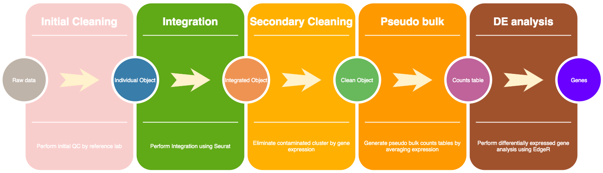
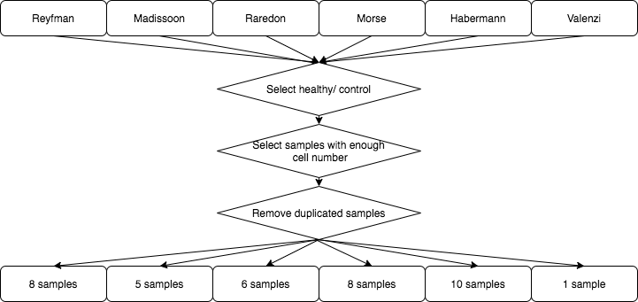
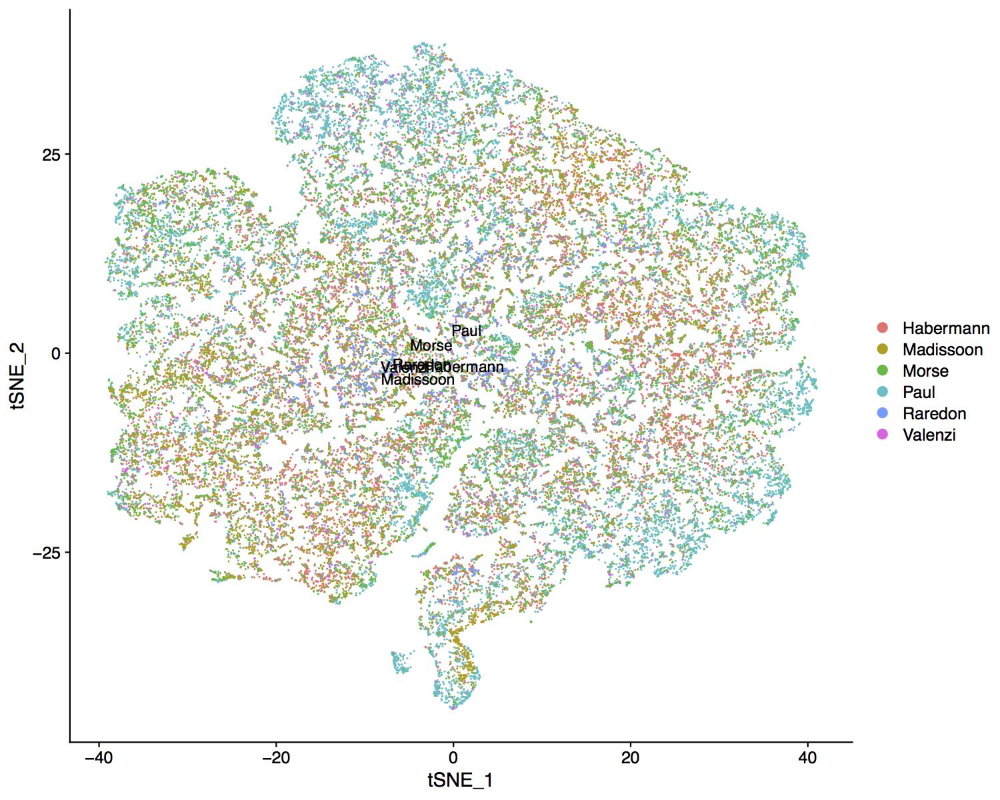

# An analysis workflow for integrating human lung scRNA-seq data to investigate age-related heterogeneity
## Abstract

(TEMP) A dysfunctional response to inhaled pathogens and toxins drives a substantial portion of the susceptibility to acute and chronic lung disease in the elderly. Using genetic lineage tracing, heterochronic adoptive transfer, parabiosis, and treatment with metformin, we found the lung microenvironment drives age-related transcriptomic changes in alveolar macrophages that include reductions in cell cycle genes and increased expression of inflammatory genes.  These changes are independent of alveolar macrophage ontogeny, circulating factors or circulating monocytes.  Changes in the microenvironment, including changes in extracellular matrix composition, induce a resistance to proliferative signals from CSF2. Severe injury can induce the replacement of long-lived tissue resident alveolar macrophages with monocyte-derived alveolar macrophages, but both respond similarly to a subsequent injury.  These findings place the lung microenvironment upstream of the dysfunctional immune responses to inhaled environmental challenge in aging.  

Single cell RNA-seq (scRNA-seq) captures the transcriptomic phenotype of multiple cell populations within a tissue simultaneously. We utilized widely used R package “Seurat” and Canonical Correlation Analysis procedure to aggregate and analyze together data from 6 published dataset. Our integration included a total number of 38 samples, covering age from 17 to 88. The merged dataset provided sufficient statistical power and homogeneity to allow discovery of common aging biomarkers across distinct cell populations. We concluded that there were no heterogeneity or emerging new cell groups in avalor macrophages, which is consistent with our observation in mouse. Through pseudo bulk, we identified 673 differentially expressed genes between young and old samples and these genes were significantly overlapped with our bulk RNAseq analysis in mouse alveolar macrophages.

## Prerequisites

Install all required R packages in the [R_requirement.txt](resources/R_requirement.txt) files using either bioconductor or CRAN

```
if (!requireNamespace("BiocManager", quietly = TRUE))
    install.packages("BiocManager")
BiocManager::install("package")
```
or

```
install.packages("package")
```

## Data availability
We included 6 public available scRNA-seq datasets from lungs of healthy controlled or donor in our analysis workflow. The source of data are list below:

* **Reyfman et al. 2019**  - [Single-Cell Transcriptomic Analysis of Human Lung Provides Insights into the Pathobiology of Pulmonary Fibrosis](https://www.ncbi.nlm.nih.gov/pubmed/30554520)
* **Madissoon et al. 2020** - [scRNA-seq assessment of the human lung, spleen, and esophagus tissue stability after cold preservation](https://www.ncbi.nlm.nih.gov/pubmed/31892341)
* **Raredon et al. 2019** - [Single-cell connectomic analysis of adult mammalian lungs](https://www.ncbi.nlm.nih.gov/pubmed/31840053)
* **Morse et al. 2019** -[Proliferating SPP1/MERTK-expressing macrophages in idiopathic pulmonary fibrosis](https://www.ncbi.nlm.nih.gov/pubmed/31221805)
* **Habermann et al. 2019** -[Single-cell RNA-sequencing reveals profibrotic roles of distinct epithelial and mesenchymal lineages in pulmonary fibrosis](https://www.biorxiv.org/content/10.1101/753806v1)
* **Valenzi et al. 2019** -[Single-cell analysis reveals fibroblast heterogeneity and myofibroblasts in systemic sclerosis-associated interstitial lung disease](https://www.ncbi.nlm.nih.gov/pubmed/31405848)


## Results

This workflow included [data integration](code/HPVMMR_integration_analysis.R) and [pseudo bulk analysis](code/Pesudo_bulkRNA_analysis.R) R code to guide the readers step by step for our analysis workflow. The following only highlighted some of the key findings:

The general workflow of our analysis was:


The total number samples was 52 and after QC control, the number of samples was 38:


We have a wide range of age from 17 to 88 years old and balanced among studies:


We used standard Seurat [SCTtransform](https://satijalab.org/seurat/v3.1/integration.html) pipeline to perform integration. After integration, we performed unbiased clustering on AM and generated 9 clusters: 

```
AM.integrated <- FindNeighbors(AM.integrated, reduction = "pca", dims = 1:30, nn.eps = 0.5)
AM.integrated <- FindClusters(AM.integrated, resolution = 0.2, n.start = 10)

```


We did not see batch effects from individual studies:


However, cluster 3 and 0 included activated macrophage characterized by SPP1 and CCL3 and lack of FABP4 expression. We removed these two clusters from our analysis and re-clustered the data.


```
AM.integrated2<-subset(AM.integrated,ident=c(1,2,4,5,6,7,8))
AM.integrated2 <- FindNeighbors(AM.integrated2, reduction = "pca", dims = 1:30, nn.eps = 0.5)
AM.integrated2 <- FindClusters(AM.integrated2, resolution = 0.2, n.start = 10)
```
There were 7 clusters after cleaning. 


There was no imbalance of age within the group.


Proven that there was no heterogeneity within age groups, we generated pseudo bulk RNA sequencing by averaging expression:

```
counts<-AverageExpression(AM.integrated,assays="integrated")
```

The DE analysis using edgeR package revealed 783 significantly down gene in aging and 215 up gene in aging between age group <30 and >60 years old. The heatmap with hierarchical clustering show samples with similar age grouped nicely together.


The trend was perserved if we used the same genes in all samples:


**Further cleaning:**

we could additionally clean up our dataset by removing clusters 2 (CCL3 and CCL4 cluster),5 (epithelial genes cluster),6 (MoAM cluster) from above object and perform DE analysis. In this case, there were even fewer upgenes in aging (66) and the down genes were similar (423). The trend was similar between <30 and >60 groups.


## Versioning

We use Seurat V3.1.2 and edgeR V3.20.9 under R V3.5.1 on Northwestern High Performance Computing Cluster. Detail session info can be found [here](resources/sessioninfo.txt).

## Authors

* **Ziyou Ren** - *Phd student in Bioinformatics* - [Northwestern University](https://labs.feinberg.northwestern.edu/budinger/members/index.html)
* **Alexandra C. McQuattie-Pimentel** - *Medical Resident* - [Northwestern University](https://labs.feinberg.northwestern.edu/budinger/members/index.html)
* **Alexander V. Misharin** - *Assistant Professor* - [Northwestern University](https://www.feinberg.northwestern.edu/faculty-profiles/az/profile.html?xid=19421)
* **GR Scott Budinger** - *Professor* - [Northwestern University](https://www.feinberg.northwestern.edu/faculty-profiles/az/profile.html?xid=10309)

See also the list of [contributors](https://github.com/NUPulmonary/Doublehit_Human_scRNA_Analysis/commits) who participated in this project.

## License

This project is licensed under the MIT License - see the [LICENSE.md](LICENSE.md) file for details

## Acknowledgments

* Northwestern IT and QUEST for their support
* NIH funding
* Driskill Graduate Program in Life Science